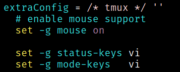

## *Kim's personal NixOS configs

- *Allows unfree packages `nixpkgs.config.allowUnfree = true`*
  - If this is something you do not want, please disable this in [profiles/common.nix](./profiles/common.nix)
- Makes use of [Home Manager](https://github.com/rycee/home-manager) to manage
  dotfiles
- Compatible with [Nix-Darwin](https://github.com/LnL7/nix-darwin) (may be
  dropping this; I no longer have a company-mandated Mac)
- Uses VAM to handle loading Neovim plugins
- Fenced syntax highlighting via a [modified version of vim-nix](https://github.com/rummik/vim-nix/tree/language-fencing)
- May be useful to others?  There are shenanigans in `nix/*.nix`, and
  some of the `default.nix` files -- primarily when dealing with imports, and
  platform specifics

### Layout
- `channels/` - Pinned channels
- `config/` - Package configurations
  - `config/home-manager` - [Home Manager](https://github.com/rycee/home-manager) configurations
- `hosts/` - Host specific configurations
- `modules/` - Custom modules
- `overlays/` - Package overlays
- `profiles/` - Configuration profiles
- `nix/` - Nix modules that may alter the default behavior of NixOS/Nix-Darwin
  - `nix/auto-host.nix` - Shenanigans to detect machine hostname, and load host-specific configurations
  - `nix/nix-path.nix` - Shenanigans for handling pinned repositories

### Searching
- Packages
  - `nix search -u`
  - `nix search <packagename>`
- Files
  - `nix-index`
  - `nix-locate <pattern>`
  - `nix-locate -r <regex>`
  - `nix-locate -w <whole file name>`

### Debugging
Run `nix repl '<nixpkgs/nixos>'`, configuration results are under `config.*`,
reload with `:r`

Or use `nixos-option` to determine the current and default values for an option,
and view the option's description

Alternatively use `nix repl '<darwin>'`, or `darwin-option` if using nix-darwin

### Fenced syntax highlighting

